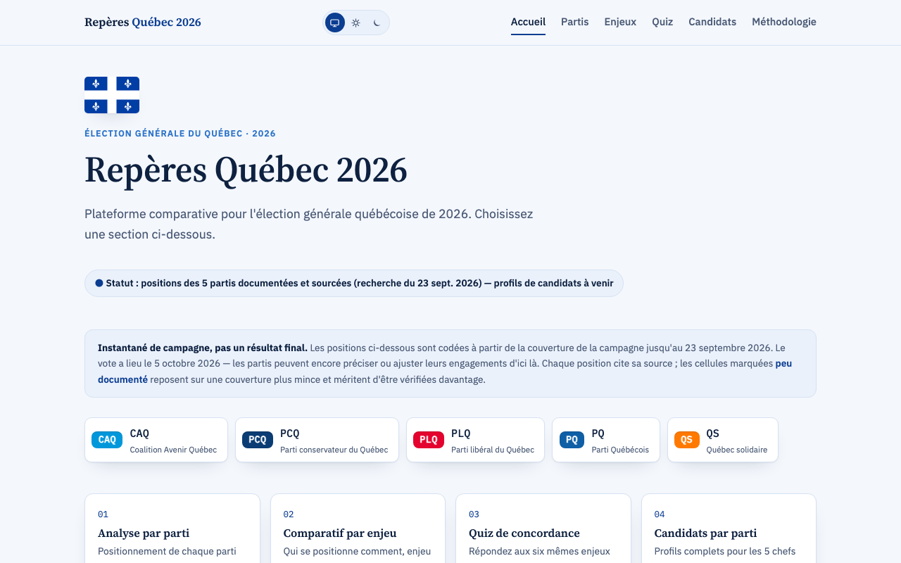
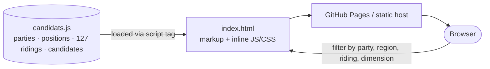

# Repères Québec 2026

Plateforme comparative pour l'élection générale québécoise de 2026 (5 octobre 2026), couvrant les cinq principaux partis : CAQ, PCQ, PLQ, PQ et QS.

## Screenshots

## Architecture

More detail: [docs/ARCHITECTURE.md](docs/ARCHITECTURE.md)

## Statut

**Mise à jour du 6 octobre 2026 : les résultats officiels du scrutin du 5 octobre (Élections Québec) sont intégrés — voir la vue « Résultats » ci-dessous.** Les positions de partis, elles, restent un instantané codé le 23 septembre, avant le vote.

**Positions de partis documentées et sourcées pour les 5 partis. Candidats : les 127 circonscriptions du Québec sont désormais couvertes — 635 candidat·e·s confirmé·e·s (5 partis × 127 circonscriptions).** Couverture complète, région par région : Mauricie ✅ → Laval ✅ → Chaudière-Appalaches ✅ → Estrie ✅ → Capitale-Nationale ✅ → Centre-du-Québec ✅ → Outaouais ✅ → Saguenay-Lac-Saint-Jean ✅ → Bas-Saint-Laurent/Gaspésie–Îles-de-la-Madeleine ✅ → Abitibi-Témiscamingue/Côte-Nord/Nord-du-Québec ✅ → Laurentides ✅ → Lanaudière ✅ → Montérégie ✅ → Montréal ✅. Les six dimensions, les couches analytiques et l'indice « Québec d'abord » sont codés pour les 5 partis à partir de la couverture de la campagne, avec une source citée sous chaque position. Voir « Sources et méthode » ci-dessous.

**Biographies enrichies (âge, études, établissement, diplôme, profession, expérience politique) — en cours, parti par parti :**
- PQ (127 candidat·e·s) ✅ terminé
- PLQ (127 candidat·e·s) ✅ terminé
- CAQ (127 candidat·e·s) ✅ terminé
- PCQ (127 candidat·e·s) ⏳ à faire
- QS (127 candidat·e·s) ✅ terminé

Voir « À venir » ci-dessous pour la méthode et l'état précis de la suite.

## Contenu

[`index.html`](index.html) — application à page unique (une seule page HTML, navigation par « pages » internes en JS, pas de défilement continu) avec six vues. Les données des candidat·e·s et la liste des 127 circonscriptions vivent dans [`candidats.js`](candidats.js) (chargé via `<script src>`), séparées du balisage et de la logique pour garder `index.html` lisible en revue.

- **Accueil** — page de repère qui dirige vers les quatre sections suivantes.
- **Partis** — analyse par parti, filtrable (CAQ/PCQ/PLQ/PQ/QS) : positionnement sourcé sur les six dimensions, couches analytiques (saillance, rhétorique populiste, transparence budgétaire, compatibilité de coalition) et indice « Québec d'abord ».
- **Enjeux** — comparatif par enjeu, filtrable par dimension : pour l'enjeu choisi, les cinq partis triés et positionnés côte à côte. Volontairement descriptif, pas de verdict — la plateforme montre les positions, le lecteur juge qui sert le mieux ses priorités pour le Québec.
- **Candidats** — gabarit complet (10 champs), en deux modes de consultation : *par parti* (filtre CAQ/PCQ/PLQ/PQ/QS) ou *par circonscription* — les **127 circonscriptions du Québec** sont toutes couvertes. Profils complets et sourcés pour les 6 chefs/coporte-parole de parti (incluant Sol Zanetti, coporte-parole de QS, candidat dans Jean-Lesage) ; nom + circonscription confirmés pour les 629 autres candidat·e·s, avec biographie documentée (profession, expérience politique) quand l'information publique le permettait — sinon gabarit marqué non documenté plutôt qu'une invention de données.
- **Résultats** — analyse du scrutin du 5 octobre 2026 à partir des données officielles d'Élections Québec ([`election-result-data/`](election-result-data/)) : sièges et vote populaire, gagnant·e et marge de victoire pour chacune des 127 circonscriptions (tableau triable/filtrable), courses les plus serrées, carte des gagnants et carte du vote par parti, résultats par région (13 groupes, ceux des fiches de candidat·e·s ; un clic zoome la carte), recherche d'une circonscription (zoom automatique), couches participation et marge de victoire, et détail par circonscription (clic sur la carte ou sur une ligne du tableau : les candidat·e·s classés, votes et parts, biographie du·de la gagnant·e quand notre fiche correspond, lien vers les fiches de la circonscription). [`resultats.js`](resultats.js) est généré depuis `resultats.json` et les contours MapInfo (reprojetés de EPSG:3798, simplifiés) ; il ne faut pas l'éditer à la main. Les cours d'eau (fleuve, estuaire moyen et maritime, golfe, rivières, lacs) proviennent d'OpenStreetMap (© contributeurs OpenStreetMap, licence ODbL), simplifiés (le fjord du Saguenay suit le contour du Parc marin du Saguenay–Saint-Laurent de Saint-Fulgence à Tadoussac ; en amont, jusqu'à Chicoutimi, et pour la rivière en amont, seul l'axe existe dans OSM et il est élargi, donc approximatif) (dans le golfe, un raccord manuel comble l'écart entre les contours OSM de l'estuaire maritime et du golfe ; l'île d'Anticosti en est retranchée) et dessinés en blanc par-dessus les circonscriptions, dont les contours officiels couvrent aussi l'eau.
- **Méthodologie** — grille de notation complète, méthodologie des couches analytiques, liste des champs de métadonnées additionnels, construction de l'indice « Québec d'abord », et note d'architecture i18n (`fr-CA` comme seule locale active pour l'instant).

## Sources et méthode

Les positions de partis ont été codées le **23 septembre 2026** à partir de la couverture journalistique de la campagne (Le Devoir, La Presse, Radio-Canada, Noovo Info, Les Affaires, Le Quotidien, entre autres) — chaque position cite sa source directement dans l'interface. La campagne se poursuit jusqu'au vote du 5 octobre 2026 : c'est un instantané, pas un résultat final, et certaines cellules sont marquées comme peu documentées faute de couverture suffisante au moment de la recherche. Ce squelette n'a pas vocation à être mis à jour en continu ; à revérifier avant toute utilisation après le 5 octobre.

## Consulter le site

Ouvrir [`index.html`](index.html) dans un navigateur, ou consulter la version publiée : https://claude.ai/artifact/28VBR4tNuypKX52TovQAkE

## À venir

Les 127 circonscriptions et les 5 partis sont couverts au niveau gabarit (nom, circonscription, parti confirmés pour chaque candidat·e). Travail en cours pour approfondir les biographies (âge, domaine d'études, établissement, diplôme, profession, expérience politique) parti par parti, dans cet ordre : PQ ✅ → PLQ ✅ → CAQ ✅ → PCQ (116/127) → QS ✅. Il reste à compléter le PCQ (11 candidat·e·s sans bio, faute de source fiable trouvée jusqu'ici). La méthode est maintenant établie pour les 5 partis.

**Méthode établie (à réutiliser pour le reste du PCQ) :**
1. Chaque parti a des pages de biographie individuelles sur son propre site (aucune bio fiable sur qc125.com, qui ne contient que des projections électorales) :
   - PQ : `https://pq.org/nos-candidats/<prenom-nom-slug>/` (ou chercher le lien exact sur `https://pq.org/nos-candidats/`)
   - PLQ : `https://plq.org/equipe/<prenom-nom-slug>/`
   - CAQ : `https://coalitionavenirquebec.org/fr/blog/equipe/<prenom-nom-slug>/`
   - PCQ : `https://conservateur.quebec/candidat/<circonscription-slug>/` (URL basée sur la circonscription, pas le nom — ex. `/candidat/trois-rivieres/`). Attention aux noms de circonscription à trait d'union long (–) : le convertir en trait d'union simple (-) avant de slugifier, sinon l'URL devinée échoue (ex. `charlevoix–côte-de-beaupré` → `charlevoix-cote-de-beaupre`, pas `charlevoixcote-de-beaupre`). Plusieurs fiches PCQ sont encore à blanc (« À venir… ») — dans ce cas, chercher une source de presse à la place plutôt que d'inventer.
   - QS : `https://quebecsolidaire.net/equipe/<code4lettres>` (code à 4 lettres par circonscription, propre au site — pas dérivé du nom ni de la circonscription ; le trouver via la liste complète rendue en JS sur `https://quebecsolidaire.net/equipe`, ex. `trri` pour Trois-Rivières, `chmp` pour Champlain). Plusieurs fiches QS sont encore sans biographie publiée (« La biographie sera disponible sous peu ») — dans ce cas, chercher une source de presse à la place plutôt que d'inventer.
2. Slugifier le nom (ou la circonscription pour PCQ) : minuscules, accents retirés, espaces/apostrophes → traits d'union.
3. Déléguer la recherche à des agents en arrière-plan par lots de ~16 candidat·e·s (WebFetch sur chaque page devinée ; si 404, repli sur WebSearch). Consigne stricte donnée aux agents : ne jamais inventer une donnée manquante — laisser le champ absent plutôt que d'écrire « non documenté » (le rendu HTML affiche déjà un tiret « — » via la fonction `cell()` pour les champs vides).
4. Intégrer les résultats dans le tableau `CANDIDATS` (désormais dans [`candidats.js`](candidats.js), pas `index.html`) en ajoutant seulement les champs confirmés (`age`, `domaine`, `etablissement`, `diplome`, `profession`, `experience`) ; garder `complet:false` sauf pour les 6 chef·fes de parti.
5. Committer et pousser vers GitHub par lots de 20 à 30 candidat·e·s enrichi·e·s (pas un seul gros commit à la fin).

**Autres tâches en attente :**
- Vérification indépendante des cellules de positions de partis marquées « peu documenté ».
- Mise à jour des positions et des candidatures si des changements significatifs surviennent avant le 5 octobre 2026 (désistements, remplacements de dernière minute après la clôture des mises en candidature du 17 septembre).

**Note :** une routine cloud automatisée (« Enrichir bios candidats QC2026 ») a été programmée le 24 septembre 2026 pour reprendre ce travail heure par heure de façon autonome, avec les mêmes consignes. Si elle est toujours active, elle peut avoir progressé sur PCQ/QS en parallèle d'une reprise manuelle — vérifier l'état du tableau `CANDIDATS` avant de relancer une recherche pour éviter les doublons.
