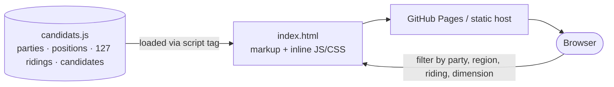

# Architecture

A static, client-side comparison site — no build step or backend.

```mermaid
flowchart LR
    Data[("candidats.js<br/>parties · positions · 127 ridings · candidates")]
    HTML["index.html<br/>markup + inline JS/CSS"]
    Browser([Browser])
    Pages[GitHub Pages / static host]

    Data -->|loaded via script tag| HTML
    HTML --> Pages --> Browser
    Browser -->|filter by party, region, riding, dimension| HTML
```

Content updates happen in `candidats.js`; `README.md` documents sources and method.
